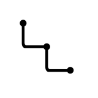

<p align="center">

<br>
<em>SiYuan Bullet Threading</em>
<br><br>
<a title="Releases" target="_blank" href="https://github.com/anarion80/siyuan-bullet-threading/releases"></a>
<a title="Downloads" target="_blank" href="https://github.com/anarion80/siyuan-bullet-threading/releases"></a>
<br>
<a title="MIT" target="_blank" href="https://opensource.org/license/mit"></a>
<a title="Code Size" target="_blank" href="https://github.com/anarion80/siyuan-bullet-threading"></a>
<a title="GitHub Pull Requests" target="_blank" href="https://github.com/anarion80/siyuan-bullet-threading/pulls"></a>
<br>
<a title="GitHub Commits" target="_blank" href="https://github.com/anarion80/siyuan-bullet-threading/commits/main"></a>
<a title="Last Commit" target="_blank" href="https://github.com/anarion80/siyuan-bullet-threading/commits/main"></a>
<br>
</p>

<p align="center">
<a href="README.md">English</a> | <a href="README_pl_PL.md">Polish</a>
</p>

## ✨ Plugin description

This is a plugin that adds bullet threading to nested lists (unordered, ordered, TODOs).

It is just extracted and repackaged plugin from excellent [Rem-Craft](https://github.com/svchord/Rem-Craft) theme (I didn't want the whole there, just bullet threading), so all credit goes to [svchord](https://github.com/svchord).

I did change alignment of the lines a little bit though, as the lines were not connecting in the middle of a bullet/number.

The plugin originally comes from LogSeq version of bullet threading: [https://github.com/pengx17/logseq-plugin-bullet-threading](https://github.com/pengx17/logseq-plugin-bullet-threading).

## ⌨ Usage

Just add some nested lists and focus one them (cursor/scroll). The plugin does not come with any styling so the lines between bullets will be white/black in dark/light modes respecively. It should change to the value of `--text-brand` when available in the theme used.

If `--text-brand` is not available in your theme, you can add the following code snippet in SiYuan settings to set the colors:

```css
:root {
    --text-brand: rgb(69, 130, 230);
}

:root.dark {
    --text-brand: rgb(97, 175, 239);
}
```
